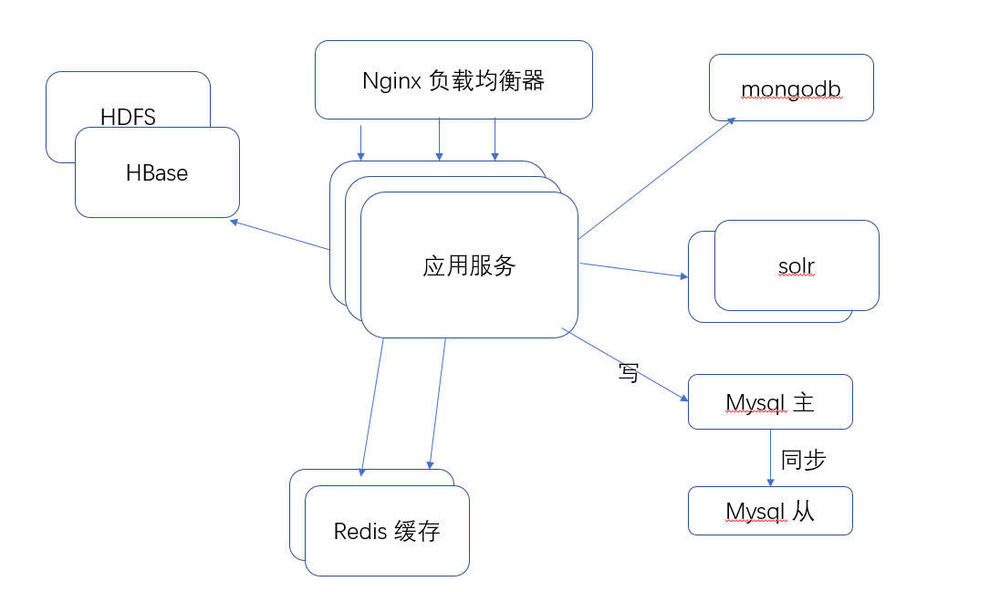

# E-book迁移到云中的方案

## 应用服务
我们开发的应用时单体的应用，应用服务之间没有划分，是一个monolithic的服务模型。由于大规模用户访问，我们需要提供多个节点的应用服务的副本以提高`Availability`。 
由于使用了多副本，因此需要保证副本之间的consistency。我们的应用有状态的服务很少，主要是和用户相关。
关于有状态无状态服务的划分，在第一次作业已经有过尝试。在本次部署中，我打算按照以下想法实施：
* 将`book`的服务尽量设计成无状态的，即所有用户访问到任何一个应用服务副本得到的都是一样的结果。
* 将`user`和`order`的服务设计成有状态的。其中`user`包含用户登录的`session`信息，可以使用`spring-boot-session`相关接口，存入`redis`中；`order`包含用户基本信息，购物车信息等，不同的用户在登陆状态下有不同的购物车，每个order也应该有一个owner。

### 负载均衡

由于使用了多副本的应用服务，为了能够使得这个多服务副本能够充分的利用起来，我们需要一层负载均衡层。 
关于负载均衡，我会选择`nginx`。由于应用服务是有状态的，如果来自一个用户1的请求状态储存在副本A中，那么用户1下一次的请求如果发送到了副本B，那么可能无法正确得到状态，这里主要有两种解决方法：
1. 利用用户id在负载均衡转发时，将某个用户的请求始终转发到应用副本中的某一个副本。

这种方法比较简单，但是可扩展性不是很高。

2. 将`user`，`order`等有状态的服务信息存储在基于`redis`的共享缓存中。

这种方法其实将应用服务的状态剥离了出来，应用就只需要负责应用计算，不需要过多维护服务状态，可扩展性比较强。

这里，我会选择第二种方法，因为这种方法可扩展性强，而且像`session`本来也是要存储在`redis`中的，既然存了`session`，不如把其他状态一并存入。

## 数据存储
`ebook`主要包含以下几类数据：
* 传统关系型的数据，包括书籍信息，用户信息，订单信息等
* 图片、文本等数据，包括用户头像、书籍封面、书籍简洁及详细介绍。
    * 这里在现在的`ebook`系统中，是存储在`mongodb`中的，但是存储在文件系统中也许更加合适，既方便做CDN，组织也简单。
* Log日志数据，存储在基于HDFS的HBase分布式数据库中
* 书籍全文搜索索引等信息。
    为了支持书籍的全文搜索，需要为每一本书籍建立索引。这里我打算采用多节点的`solr`来支持，以提高可用性和容错。
* 共享缓存
    在应用服务多副本中，有共享的状态信息。这些信息需要存储在全局共享缓存中，因此我将部署一个分布式的redis缓存。 
    此外，对于频繁访问的无状态数据，`redis`可以作为这些数据的缓存

## 事务管理
在`ebook`中，事务主要在于修改用户的状态，比如修改用户购物车，修改用户密码等等。在这些场景中，需要保证一旦用户看见了修改成功，则这些状态必须已经持久化，做到coherence。

事务的管理主要依赖两点：
1. Spring提供的Transactional事务机制，针对敏感区域的代码，必须在事务中执行，使用`SUPPORTS`标注。

2. 数据库提供的事务机制，比如`Mysql`提供的四种事务隔离级别

## 数据并行处理方式

首先因为应用是多副本的，所以在整个系统中是有很多部分的并行计算的。
在我们的`ebook`中，有一个统计用户访问次数的功能，这个功能需要精确到人次，在应用多副本的情况下，似乎不是很好处理，所以这一块我觉得可以拆分成一个单独的进程服务，凡是访问这个路由的请求，由`负载均衡层`转发到这里即可。

在整个系统中运行着许多的框架，`solr`的全文搜索服务，`neo4j`图数据库，`hdfs`、`hbase`，这些都是整个系统依赖的服务，它们也会在后台不断的维护更新它们的元数据信息等等，和应用服务的实际计算是并行处理的。

考虑到`mysql`可能成为性能瓶颈，我们有可能需要将`mysql`部署成主从结构，每次更新都更新到`主节点`，读取可以分摊到两个节点

如果我们的流量存在突发峰值情况，我们也许还需要将服务拆分成消息解耦形式，利用`kafka`等`MQ`中间件来平均化流量。

## 系统结构图

